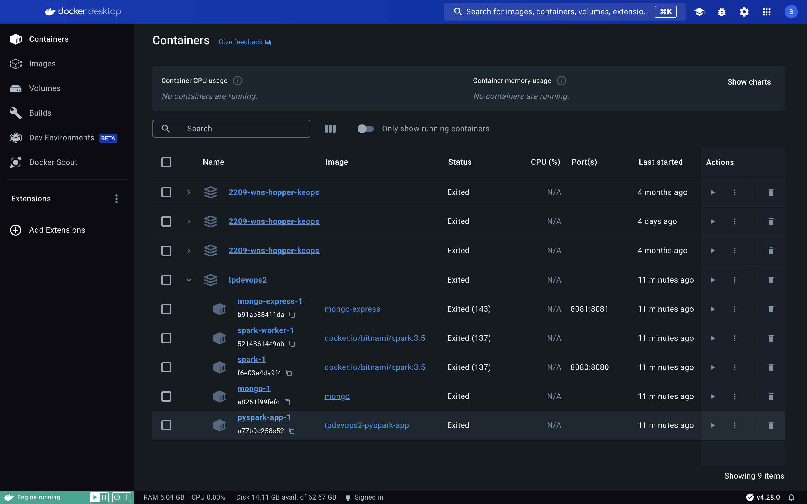
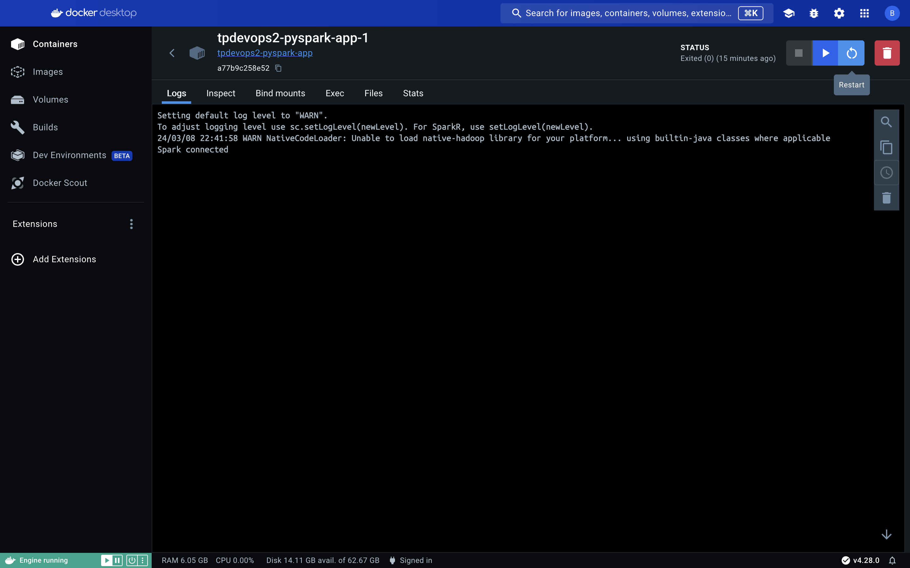

# Hetic Devops

Welcome on hetic devops, this repository is used for launch a mongodb database and a Apache Spark Cluster.
It will execute a python script in a venv using docker compose.

## Prerequest

- Install [Docker](https://docs.docker.com/engine/install/)
- Install [Docker-Compose](https://docs.docker.com/compose/install/)
- Install [Docker Desktop](https://www.docker.com/products/docker-desktop/)

## Install and run the project

1. Clone the repo

```
git clone https://github.com/Barret-Pierre/hetic_devops.git
```

2. Go to the root folder

3. ⚠️ Open your Docker Desktop

4. Run all the containers with docker compose

```
docker-compose up --build
```

This command run an **Apache Spark Cluster**, a **Mongo database** with **UI** and a **Python environement** for execute the **scrypt.py** in /app folder.

The scrypt.py create first conneciton with the Apache Spark Cluster.

## Mongo DB

- MongoDB run on port **:27017** it's not accessible directly but you can go to the UI mongo on `http://localhost:8081`.

## Apache Spark Cluster

- There are two Spark cluster, the first one is the master and the second the worker.
- You can access to Master on `http://localhost:8080`.

## Python Script

- The python container is mount by dockerfile local image. During build dockerfile use `requirements.txt` that regroupe all the python packages necessary.
- The python script in /app folder run one time where the DB ans Apache Spark Cluster are alive.
- The python container is accessible by docker desktop.



- You can reload the execution of the python scrypt in docker desktop.



## Docker compose

Voici un petit rapelle des commande de base.

- Executer un fichier docker compose en particulier

```
docker-compose -f <chemin_du_fichier_docker_compose.yml> up --build
```

- Executer un service en particulier dans un fichier en particulier

```
docker-compose -f <chemin_du_fichier_docker_compose.yml> run <nom_du_service>
```

- Afficher les containers qui tournent

```
docker ps
```

- Afficher tout les containers

```
docker ps -a
```

- Down le docker en cours avec **Ctrl + c**

- Supprimer les ressources inutilisées

```
docker prune
```
